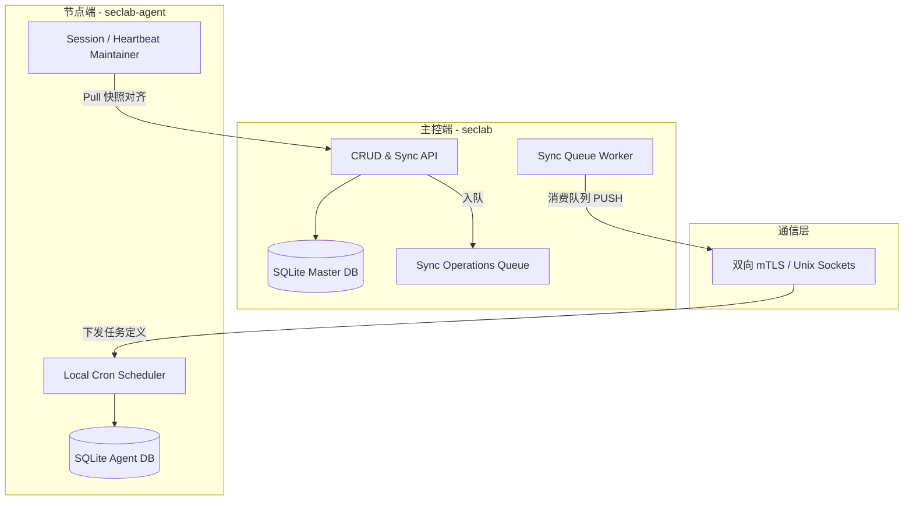
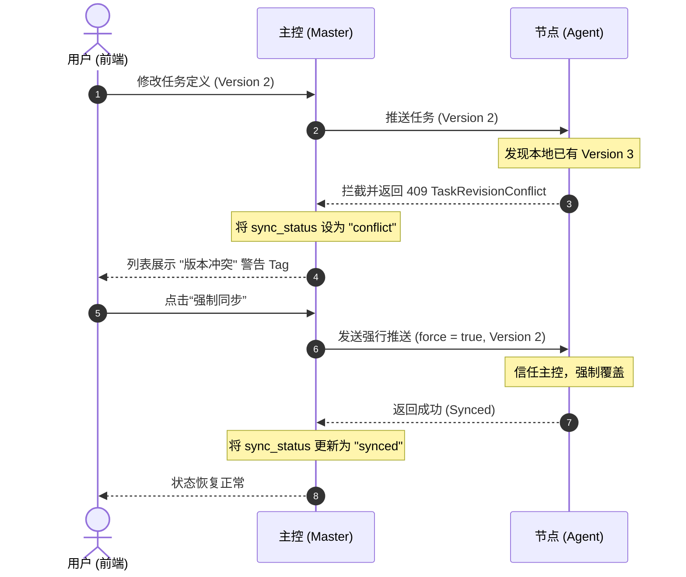

# SecLab 计划任务 (Scheduled Tasks) 应用设计文档

本设计文档阐述了 SecLab 系统中计划任务（定时任务）应用在多节点分布式环境下的核心架构、同步对齐机制、版本冲突防御以及执行历史管理。

---

## 1. 总体架构设计

SecLab 的计划任务系统采用 **主控端 (Fact Source)** 与 **分布式节点端 (无状态/轻量存储调度器)** 的双层协同架构。

### 1.1 主控端 (Master - seclab)
* **单一真理源 (Single Source of Truth / Fact Source)**：主控端对所有节点的计划任务定义进行中心化管理，维护完整的任务元数据、修订版本号（`revision`）和执行状态。
* **主要职责**：提供任务的增删改查 API、计划任务同步队列、自动 Reconciliation 机制以及接收 Agent 实时上报的执行结果。

### 1.2 节点端 (Agent - seclab-agent)
* **轻量级本地调度器**：Agent 本地不独立修改任务定义，仅通过 SQLite 缓存从主控同步过来的任务副本，并由本地的 Cron 引擎（支持 UTC 时区解析）在目标节点上独立触发。
* **最小化本地日志存储**：本地仅持久化任务执行的完整 `stdout` 与 `stderr`，每个任务最多保留最近 500 条历史记录以限制磁盘占用；不再本地持久化 `log_excerpt`（日志摘录），而是在 API 代理查询时动态生成。

---

## 2. 三向同步对齐机制 (Reliable Reconcile)

为应对复杂的网络波动、Agent 离线以及进程重启等分布式常见异常，系统引入了 **主动推送 (PUSH) + 变更操作队列 (QUEUE) + 主动拉取 (PULL)** 的三向同步保障机制。

### 2.1 推送机制 (Push-based Sync)
当主控中计划任务新建、更新、开关时，立即触发 API 同步。主控通过 UDS (本地节点) 或双向 mTLS 认证的 HTTPS 客户端 (远程节点) 将任务定义推送至 Agent。

### 2.2 同步操作队列 (Sync Operations Queue)
当向 Agent 推送同步由于网络抖动或节点离线失败时，主控会通过同步队列机制保障最终一致性。
* **数据持久化**：主控使用 `task_sync_ops` 数据库表持久化记录待对齐的操作（`upsert` 或 `delete`）。操作记录中保留了 `agent_id`，以确保在主控端任务被物理删除后，后台仍能向目标 Agent 发送删除指令。
* **操作折叠 (Operation Folding)**：在向队列添加同步动作时，系统会自动检查当前对于该任务是否已有未完成的（`pending` 或 `failed`）操作。若存在，则直接就地更新其操作类型与版本号，消除冗余的同步请求，防止网络恢复后产生同步风暴。
* **Worker 异步消费**：主控后台运行一个同步队列 Worker 进程，周期性（默认每 5 秒）轮询重试。同时，在任务入队时通过 `std::sync::OnceLock` 构建的 `SYNC_NOTIFY` 信号即时唤醒 Worker，在网络通畅时提供近似于实时推送的同步体验。

### 2.3 主动快照拉取对齐 (Pull-based Sync)
推送与队列主要解决“由主控状态改变触发的单向同步”，为防止边缘极端异常（例如心跳断连期间队列丢失）导致的状态漂移，系统设计了基于 Agent 主动 Pull 的快照对齐机制：
* **快照 API**：主控端 Runtime 模块提供 `GET /api/v1/runtime/tasks/snapshot` 接口，以活跃的 `session_id` 和 `agent_id` 作为核心安全凭证，向 Agent 提供该节点下所有任务的版本与定义快照。
* **定时与上线双触发契机**：
  1. **初始化上线对齐**：Agent 在初始化上线或网络重连成功建立 Runtime Session 后，立即发起一次快照拉取，进行全量同步。
  2. **周期性心跳对齐**：在 Agent 会话维持循环中，每隔 5 分钟 (300 秒) 发起一次周期性的 Tick，强制拉取快照对齐。
* **快照对齐判定规则**：
  * **主控有，本地无 / 版本不一致**：Agent 以主控快照为 Fact Source，在本地强制 upsert 覆盖。
  * **本地有，主控无**：判定为多余的脏数据，Agent 本地直接物理删除以对齐快照。

---

## 3. 版本冲突防御与解决 (Conflict Resolution)

在极少数情况下（例如主控端未及时同步的变更与 Agent 本地发生漂移），为防止状态的盲目覆盖，系统引入了修订版本号校验：

### 3.1 版本修订号校验
* 任务每次被修改或 toggle 时，主控的 `revision` 会自增 1。
* Agent 在执行 `upsert_task` 接口时，若发现请求中的 `payload.revision < existing.revision` 且 `payload.force` 不为 `true`（或为 `None`/`false`），则拒绝写入，直接返回 409 Conflict，携带业务错误码 `TASK_REVISION_CONFLICT`。

### 3.2 冲突处理机制
* 主控捕获到来自 Agent 的版本冲突异常后，将该任务的同步状态设为 `conflict`，并在主控侧记录该冲突错误原因。
* 前端通过 `TaskSchedulerView.vue` 识别状态并在列表页渲染红色的“版本冲突”警告 Tag。
* 此时操作菜单中的“重试同步”将动态变更为**“强制同步”**。用户点击确认后，前端向主控发起携带 `force: true` 参数的手动同步 API，强行同步覆盖 Agent 本地的版本以解决冲突。

---

## 4. 执行历史与离线可用性

为向用户提供连贯的体验，任务运行的记录采用“双向协同”与“代理 + 缓存”的离线高可用设计。

### 4.1 执行结果主动上报 (Active Reporting)
1. 任务在 Agent 本地执行（无论是定时触发还是 API 代理立即执行），运行落盘后，其结果被打包为 `TaskRunReportPayload` 发送至 Agent 本地的 Lazy 全局通信通道 `TASK_RUN_CHANNEL`。
2. Agent 心跳会话维持线程（`maintain_runtime_session`）消费该信道，将执行结果上报给主控的 `/api/v1/runtime/tasks/runs/report` 接口。
3. 主控采用唯一 `run_id` 联合索引（UUID v7）进行防重入库。

### 4.2 离线可用性设计 (Read Fallback)
* 前端列表页拉取执行历史时，主控接口优先代理网络请求直接向 Agent 本地拉取最新的历史记录（优先保障数据实时性）。
* 若目标 Agent 处于离线状态，主控会自动降级回退（Fallback）至主控端本地数据库中缓存的 `task_runs` 历史数据，实现了在 Agent 离线状态下仍然能展示最后已知执行历史的“离线可用性”。
