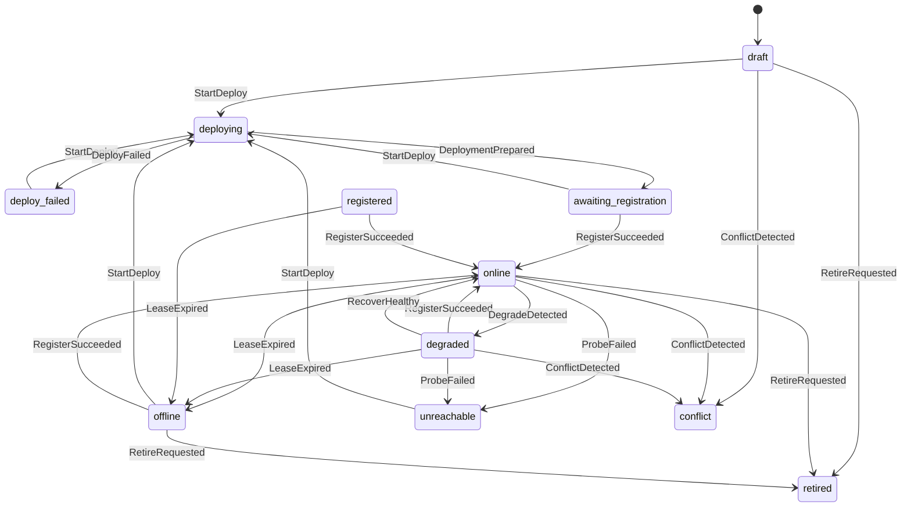
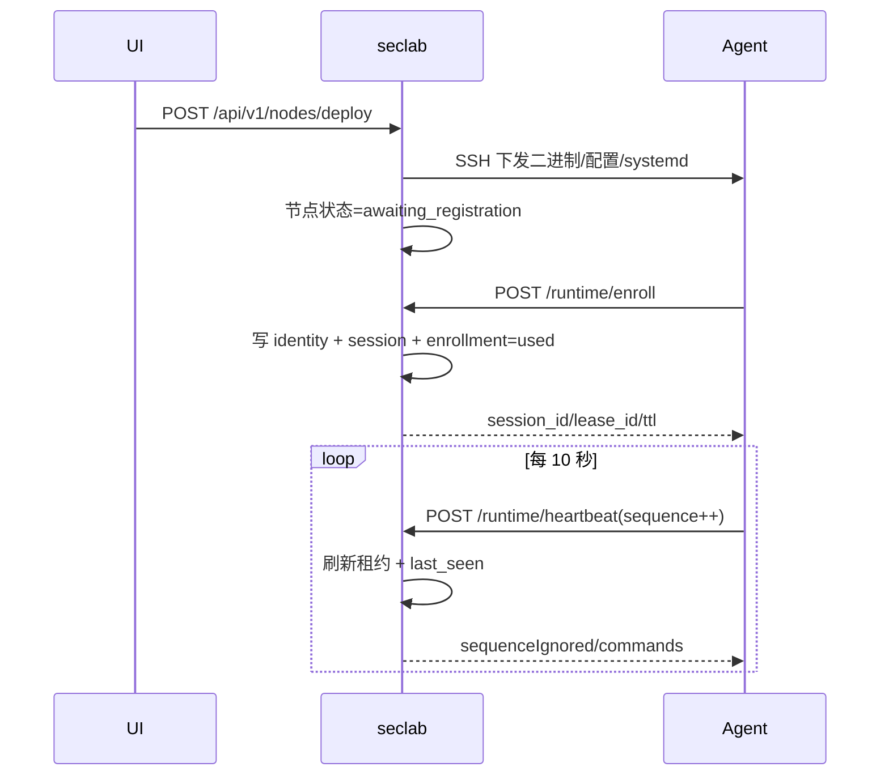
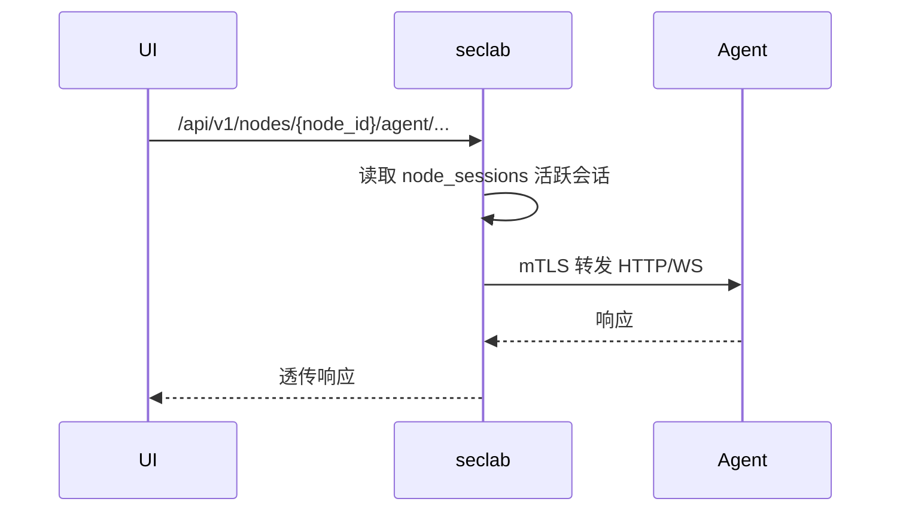

# SecLab 运行时协议与运维手册

本文档用于补齐 M7 文档项，覆盖注册协议正文、状态机图、时序图、配置说明与运维手册。

---

## 1. 注册协议正文

### 1.1 首次纳管（`enroll`）

1. `seclab` 为 `node_id` 签发一次性 `enrollment_token`（默认 24 小时过期）。
2. 节点 `agent` 启动后调用 `POST /api/v1/runtime/enroll`，携带：
   `enrollmentToken`、`node.advertiseAddr`、`node.listenPort`、`certificateRequest`。
3. `seclab` 校验 token：
   - 必须存在且状态为 `issued`
   - 未过期、未撤销
   - 目标节点不得已有活跃会话（否则进入 `conflict`）
4. 校验通过后：
   - 写入或更新 `node_identities`
   - 创建 `node_sessions` 活跃会话
   - `node_enrollments` 标记为 `used`
   - 节点状态转为 `online`

### 1.2 再注册（`register`）

1. `agent` 调用 `POST /api/v1/runtime/register`，携带 `agentId` 与节点地址信息。
2. `seclab` 校验 `agent_id` 必须已存在身份记录。
3. 若存在旧活跃会话：
   - 同地址同端口：直接复用，幂等返回
   - 地址变化：关闭旧会话并创建新会话
4. 节点状态收敛到 `online`。

### 1.3 心跳续租（`heartbeat`）

1. `agent` 调用 `POST /api/v1/runtime/heartbeat`，携带
   `agentId/sessionId/leaseId/sequence`。
2. `seclab` 校验会话、租约与身份匹配。
3. 以 `sequence` 实现幂等去重：
   - 新序号：刷新租约与 `last_seen_at`
   - 旧序号：返回 `sequenceIgnored=true`
4. 租约默认 TTL：30 秒，建议心跳间隔：10 秒，主控每 5 秒扫描并回收过期活跃会话。
5. 当主控不可达时，agent 按指数退避重连：3s、6s、12s、20s 上限，并附加 0-3s jitter 避免集群同时重连。

### 1.4 注销（`deregister`）

1. `agent` 调用 `POST /api/v1/runtime/deregister`。
2. `seclab` 关闭会话并在无活跃会话时将节点状态收敛为 `offline`。

---

## 2. 状态机图

---

## 3. 时序图

### 3.1 部署 -> 首次注册 -> 心跳续租

### 3.2 节点代理（HTTP / WebSocket）

---

## 4. 配置说明

### 4.1 seclab 关键配置

- 监听配置：
  - 文件：运行时配置（`host` / `port`）
  - 接口：`GET/PUT /api/v1/seclab/network`
- 代理参数：
  - 连接超时：3 秒
  - 请求超时：20 秒
- 证书：
  - `seclab` 使用受信 CA 与客户端证书访问节点执行面

### 4.2 agent 关键配置

- `mode=remote`
- `listenAddr`：节点执行面监听地址
- `agentId`：运行时身份标识
- `seclabUrl`：控制面地址
- `enrollmentToken`：首次纳管令牌

### 4.3 租约与心跳

- `lease_ttl_seconds`：30
- `heartbeat_interval_seconds`：10
- `session_reaper_interval_seconds`：5
- `agent_reconnect_backoff_seconds`：3、6、12、20 上限，附加 0-3 秒 jitter
- 去重键：`session_id + lease_id + sequence`

---

## 5. 运维手册

### 5.1 升级

1. 调用 `POST /api/v1/nodes/{node_id}/upgrade`
2. 复用统一部署管线下发新二进制与配置
3. 观察 `node_provisioning.last_deploy_result_status=upgraded`

### 5.2 修复

1. 调用 `POST /api/v1/nodes/{node_id}/repair`
2. 重建 systemd 与关键文件
3. 观察 `last_deploy_result_status=repaired`

### 5.3 退役

1. 调用 `POST /api/v1/nodes/{node_id}/retire`
2. 关闭活跃会话，节点状态转 `retired`
3. 节点 `schedulable=0`

### 5.4 卸载

1. 调用 `POST /api/v1/nodes/{node_id}/uninstall`
2. 远程执行 stop/disable + 删除服务与二进制
3. 节点状态转 `retired`，并记录卸载结果

### 5.5 常见故障定位

- 注册失败：检查 token 状态、过期时间、节点是否已有活跃会话。
- 心跳异常：检查 `session_id/lease_id/sequence` 是否匹配与单调递增。
- 代理失败：检查活跃会话存在性与 `advertise_addr/listen_port`。
- 部署失败：检查 SSH 认证、systemd、目录权限与 Docker 环境。
