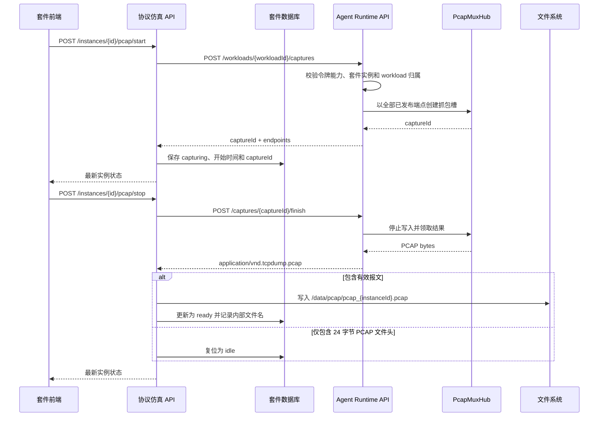

# SecLab 协议仿真 PCAP 取证设计规范

本文档定义协议仿真套件基于 Suite Runtime 的交互式 PCAP 取证实现。

## 1. 职责边界

| 组件 | 职责 |
| --- | --- |
| 套件前端 | 发起开始、停止、下载和删除操作，展示实例级抓包状态。 |
| 套件 API | 维护实例状态，调用 Runtime SDK，将有效 PCAP 保存到套件数据卷。 |
| Runtime SDK | 读取 Agent 注入的运行描述和凭据，封装抓包 API 与二进制响应。 |
| Agent | 校验套件实例与 workload 归属，按 workload 的全部已发布端点抓包。 |

主控不保存协议仿真 PCAP。Agent 在抓包会话期间使用临时文件组装 PCAP，套件完成抓包后才把成品文件写入自身 `/data/pcap/`。

## 2. Agent Suite Runtime API

Runtime API 以 Agent 服务基路径 `/api/v1/agent` 为基准：

```text
POST /suite-runtime/workloads/{workload_id}/captures
POST /suite-runtime/workloads/{workload_id}/captures/{capture_id}/finish
```

开始抓包不接收请求体。Agent 从已登记 workload 中解析发布端点，避免套件自行提交端口而越过所有权校验。

DNS 双传输 workload 的开始响应示例：

```json
{
  "captureId": "pcap-019c...",
  "status": "capturing",
  "endpoints": [
    { "endpointId": "dns-tcp", "protocol": "tcp", "hostPort": 1053 },
    { "endpointId": "dns-udp", "protocol": "udp", "hostPort": 1053 }
  ]
}
```

停止成功直接返回 `application/vnd.tcpdump.pcap` 二进制内容，不使用 Base64 JSON 包装。套件必须流式读取或按字节读取响应，不得按 UTF-8 文本处理。

Agent 从运行令牌恢复 `suiteId` 和 `instanceId`，并校验目标 workload 属于该套件实例。调用方还必须拥有 `captures.manage` 能力；请求参数不能覆盖这些身份信息。

## 3. 多端点抓包

Agent 内部使用 `PcapMuxHub` 复用宿主机抓包能力：

1. 同时处理 IPv4、IPv6 报文和 TCP、UDP 传输。
2. 捕获槽以 `(transport, host_port)` 为键，不能只按数字端口分流。
3. 同一 workload 的全部已发布端点在一个 capture 中启动和停止。
4. DNS 可同时捕获 `1053/TCP` 与 `1053/UDP`，相同数字端口不会相互覆盖。
5. 报文命中任一端点即按到达顺序写入同一个 PCAP 数据流。
6. 单次抓包最长 300 秒；Agent 到期停止收集，并为套件保留最多 300 秒的完成结果以便领取。

抓包目标来自 workload 的实际发布结果，不来自规则包中的 `containerPort`，也不来自前端显示值。这样用户把主机监听端口改为非默认值后，抓包仍与真实端口一致。

## 4. 套件实例状态

`instances` 表维护以下状态：

| 字段 | 说明 |
| --- | --- |
| `pcap_status` | `idle`、`capturing` 或 `ready`。 |
| `pcap_start_time` | 开始抓包时间。 |
| `pcap_capture_id` | Agent 返回的 capture ID。 |
| `pcap_file_path` | `/data/pcap/` 下的成品文件名。 |

状态流转：

```text
idle      --开始成功--> capturing
capturing --有效 PCAP--> ready
capturing --仅文件头--> idle
capturing --结束失败--> capturing
ready     --删除成品--> idle
```

处理规则：

1. 只有实例处于运行状态且没有活动 capture 时才能开始。
2. Agent 开始成功后记录 `captureId` 并切换为 `capturing`。
3. 停止响应长度小于等于 24 字节时视为只有 PCAP 文件头，不生成成品，状态复位为 `idle`。
4. 有效内容写入 `/data/pcap/` 成品文件后切换为 `ready`。
5. `DELETE /api/instances/{id}/pcap` 删除成品并复位状态。
6. workload 删除、套件停用或卸载时，Agent 必须终止相关活动 capture，不能遗留后台抓包任务。

## 5. 套件侧 API 与下载安全

协议仿真套件对前端提供：

```text
POST   /api/instances/{id}/pcap/start
POST   /api/instances/{id}/pcap/stop
POST   /api/instances/{id}/pcap/download
DELETE /api/instances/{id}/pcap
```

下载接口根据实例记录定位服务端生成的内部文件名，不接收任意文件路径。读取前必须校验受管文件名，并只能从 `/data/pcap/` 读取；响应使用 PCAP 内容类型和 `attachment`。前端在创建浏览器下载时设置友好文件名 `sl-<监听端口>-<规则 ID>.pcap`，例如 `sl-8080-190001.pcap`。不得提供按用户输入文件名读取目录的通用接口。

开始、停止、删除属于状态变更操作，应写入协议仿真套件审计日志；面向平台的关键操作按需通过 `operation-logs.write` 上报，抓包内容和凭据不得进入日志。

## 6. 故障与清理

- Agent API 超时或返回错误时，套件保留可诊断错误信息，但不能伪造 `ready` 状态。
- 结束失败时保留 `capturing` 供重试，不得把未领取的结果标记为 `ready`。
- 套件 API 重启后依据数据库中的 `pcap_start_time` 和 `pcap_capture_id` 扫描过期会话，并尝试向 Agent 领取结果。
- 删除 workload 前先结束 capture；卸载套件实例时按实例所有权清理全部 workload 与 capture。
- PCAP 文件只面向已授权的当前套件用户下载，不通过 Compose 静态目录公开。

## 7. 端到端实现时序



开始、结束、删除和自动结束都经过同一实例的生命周期锁，使抓包状态变更与实例撤销部署操作串行化。

## 8. Agent 抓包实现

### 8.1 会话与端口索引

Agent 从 workload 标签 `seclab.workload_ports` 读取真实发布端点，生成 `captureId`，并在进程内建立抓包槽。抓包槽记录套件实例 ID、workload ID、PCAP 写入通道和结束信号；`finish` 只能领取归属于当前套件实例与 workload 的会话。

`PcapMuxHub` 以 `(TCP|UDP, hostPort)` 建立端口索引。同一个抓包会话可以占用多个键，但任一键已存在活动会话时，新会话将被拒绝。

### 8.2 全局监听器与报文分发

Agent 在 Linux 上通过 `AF_PACKET` 原始套接字抓取宿主机报文，运行身份需具备 root 权限或 `CAP_NET_RAW`。它为符合条件的宿主机网卡启动读取任务，排除 loopback、Docker bridge、veth、CNI 等虚拟接口。第一个抓包槽启动全局监听器，最后一个活动端口释放后停止监听器。

报文分发流程如下：

1. 解析 Ethernet 或 Linux cooked 链路层头。
2. 解析 IPv4/IPv6 及 TCP/UDP 源、目的端口；IPv4 非首分片不参与端口匹配。
3. 源端口或目的端口命中端口索引后，将 IP 报文投递到对应抓包槽。
4. 写入器以 Raw IP 链路类型（PCAP link type 101）追加报文，成品可直接由 Wireshark 或 tcpdump 读取。

每个抓包槽的报文通道容量为 1000。全局监听器使用非阻塞投递，高流量下通道已满的报文会被丢弃，以避免单个会话阻塞全局抓包。

### 8.3 临时文件与超时

每个抓包槽使用系统临时目录中的 `<captureId>.pcap` 组装内容。正常结束时，写入器关闭文件、读取全部字节、删除临时文件，再由 `finish` 响应返回。

Agent 的 300 秒 watchdog 负责停止报文收集；到期结果在进程内继续保留 300 秒，供套件的自动结束任务调用 `finish`。保留期结束仍未被领取时，Agent 丢弃结果并清理会话。

## 9. 套件侧一致性与恢复

1. 实例生命周期锁保证同一实例的开始、结束、删除和撤销部署不会并发执行。
2. 开始成功后持久化 `pcap_start_time` 和 `pcap_capture_id`，再创建套件侧 300 秒自动结束任务。
3. 自动结束携带预期 `captureId`。锁内重新读取数据库后，只结束 ID 仍一致的会话，避免旧定时任务影响后续抓包。
4. 套件 API 重启后，实例列表与状态对账会扫描超过 300 秒的 `capturing` 记录，并使用持久化的 `captureId` 尝试领取 Agent 保留的结果。
5. Agent 结束请求失败时，数据库保持 `capturing`，并记录审计事件和错误日志；成品文件和 `ready` 状态只由成功领取的有效 PCAP 产生。

Agent watchdog 与套件自动结束共同组成两层超时保护：前者确保宿主机不会持续抓包，后者负责领取结果并完成套件状态转换。

## 10. 文件命名与清理

| 阶段 | 位置 | 命名 | 用途 |
| --- | --- | --- | --- |
| Agent 写入 | 系统临时目录 | `<captureId>.pcap` | 抓包会话期间组装数据。 |
| 套件持久化 | `/data/pcap/` | `pcap_<Instance.id>.pcap` | 以实例 ID 保证内部文件唯一性。 |
| 浏览器下载 | 用户选定的目录 | `sl-<监听端口>-<规则 ID>.pcap` | 提供可读的下载文件名。 |

`pcap_file_path` 只保存受管文件名，合法格式为 `pcap_` 前缀、字母数字或连字符主体以及 `.pcap` 后缀。下载、删除和启动清理都必须使用同一受管文件名校验，路径分隔符和非受管名称会被拒绝。

套件启动时以数据库中的 `pcap_file_path` 为引用集，扫描 `/data/pcap/` 并删除未被引用的受管普通文件。非受管文件和目录保持不变；用户删除 PCAP 时，文件删除按幂等方式处理。

## 11. 实现索引与验证重点

| 实现位置 | 责任 |
| --- | --- |
| `seclab-agent/crates/seclab-agent/src/api/suite_workloads.rs` | Runtime 抓包路由、能力与归属校验、workload 端点解析。 |
| `seclab-agent/crates/seclab-agent/src/services/pcap.rs` | `PcapMuxHub`、原始套接字监听、报文分发、PCAP 写入和超时。 |
| `seclab-suite-protocol-simulation/crates/protocol-simulation/src/routes.rs` | 实例状态机、生命周期锁、自动结束、下载和审计。 |
| `seclab-suite-protocol-simulation/crates/protocol-simulation/src/pcap.rs` | 内部文件命名、路径校验、删除和孤儿文件清理。 |
| `seclab-suite-protocol-simulation/frontend/src/apps/views/SimulationView.vue` | 交互入口、状态展示和下载文件命名。 |

验证时至少覆盖：TCP 与 UDP 同端口分流、多端点合并、端口占用冲突、空 PCAP 复位、有效 PCAP 持久化、旧定时任务保护、过期会话恢复、路径穿越拒绝、孤儿文件清理以及下载文件名 `sl-<监听端口>-<规则 ID>.pcap`。
