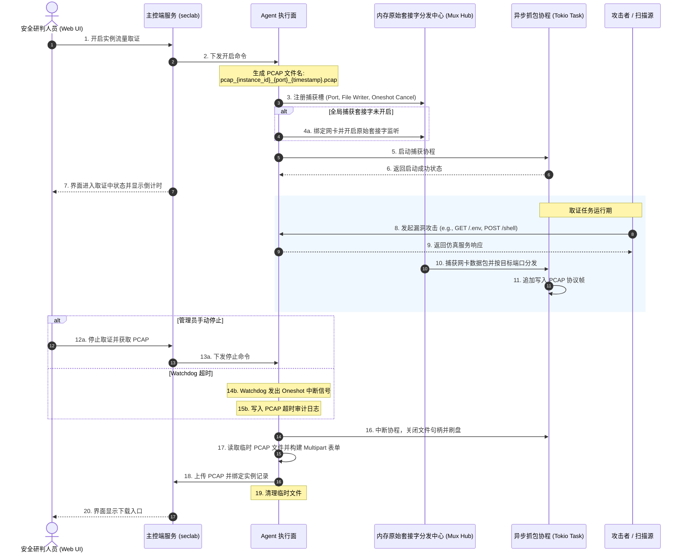

# SecLab 交互式 PCAP 流量取证设计规范

本文档定义 SecLab 协议仿真模块的交互式 PCAP 流量取证方案。Agent 使用 Rust 用户态原始套接字和内存多路复用机制捕获网络报文，不依赖 `tcpdump` 等外部抓包工具。

---

## 1. 设计目标

流量取证用于保存协议仿真实例的攻击交互证据，设计目标如下：

### 1.1 会话报文捕获

捕获范围应覆盖一次攻击交互中的关键网络报文：

- TCP 建连报文。
- 攻击请求报文，包括协议头和负载。
- 仿真服务响应报文。
- 连接关闭报文。

### 1.2 外部依赖

Agent 内置 PCAP 序列化和原始套接字抓包逻辑。受控节点不需要安装 `tcpdump` 或其他第三方抓包程序。

### 1.3 资源控制

取证任务必须限制资源占用：

- 抓包任务由 Tokio Task 驱动，不派生外部进程。
- 多实例同时取证时，共用一个原始套接字监听器。
- 通过内存多路复用按目标端口分发报文。
- 每个取证任务必须有最大持续时间，超时后自动停止。

---

## 2. 多路复用时序

Agent 内部的异步任务负责收包、分发、写入和上传：



---

## 3. 数据结构与算法

### 3.1 仿真运行实例表扩展

仿真运行实例需要记录取证状态：

```sql
-- DDL 升级规范：在 Alpha 阶段原地扩充
ALTER TABLE sim_instances ADD COLUMN pcap_status TEXT NOT NULL DEFAULT 'idle';
ALTER TABLE sim_instances ADD COLUMN pcap_start_time INTEGER DEFAULT NULL;
ALTER TABLE sim_instances ADD COLUMN pcap_file_path TEXT DEFAULT NULL;
```

- `pcap_status`:
  - `idle`：未取证。
  - `capturing`：取证任务运行中。
  - `ready`：PCAP 已回传，可下载。

### 3.2 Agent 多路复用分发器

Agent 使用单套接字多路分发中心管理活跃取证任务：

```rust
use std::collections::HashMap;
use tokio::sync::{mpsc, oneshot};
use tokio::task::JoinHandle;

/// 原始数据包帧。
pub struct RawPacketFrame {
    pub timestamp_sec: u32,
    pub timestamp_usec: u32,
    pub source_ip: String,
    pub dest_port: u16,
    pub packet_data: Vec<u8>,
}

/// 实例捕获控制槽。
struct ForensicSlot {
    pcap_writer_tx: mpsc::Sender<RawPacketFrame>,
    cancel_tx: oneshot::Sender<()>,
    start_timestamp: i64,
}

/// 全局多路分发中心。
pub struct PcapMuxHub {
    /// 活跃实例抓包槽，key 为端口号。
    active_slots: std::sync::Arc<tokio::sync::Mutex<HashMap<u16, ForensicSlot>>>,
    /// 全局网卡监听任务句柄。
    global_listener_handle: Option<JoinHandle<()>>,
}
```

### 3.3 Watchdog 超时控制

每个取证任务必须绑定 Watchdog：

```rust
fn spawn_watchdog_timer(port: u16, cancel_rx: oneshot::Receiver<()>, max_duration: std::time::Duration) {
    tokio::spawn(async move {
        tokio::select! {
            _ = tokio::time::sleep(max_duration) => {
                tracing::warn!(
                    "[WATCHDOG] Self-contained Rust capture on port {} reached safety timeout limit. Auto-stopping...",
                    port
                );
                let _ = trigger_auto_stop_and_upload(port, true).await;
            }
            _ = cancel_rx => {
                tracing::info!("[WATCHDOG] Safety timer for port {} successfully cancelled.", port);
            }
        }
    });
}
```

默认最大持续时间为 5 分钟。超时后，Watchdog 停止取证、触发上传流程，并写入审计日志。

---

## 4. 临时文件与上传

PCAP 写入临时文件后再上传到主控：

1. 临时目录由 Agent 运行配置决定，默认可使用系统临时目录。
2. 文件名格式为 `pcap_{instance_id}_{port}_{timestamp}.pcap`。
3. 停止取证后，Agent 关闭文件句柄并刷盘。
4. Agent 通过 Multipart 上传 PCAP 文件。
5. 上传成功后，Agent 删除本地临时文件。
6. 主控保存文件路径，并将实例状态更新为 `ready`。

---

## 5. UI 状态规范

实例管理界面按 `pcap_status` 展示操作：

1. **空闲态 (`idle`)**：
   - 显示“开启流量取证”操作。
   - 操作成功后进入 `capturing`。
2. **取证态 (`capturing`)**：
   - 显示“停止取证并回传 PCAP”操作。
   - 显示已运行时长和最大持续时间。
   - 超时或手动停止后进入上传流程。
3. **就绪态 (`ready`)**：
   - 显示“下载 PCAP”操作。
   - 可提供“删除 PCAP”操作，用于清理文件并复位状态。
