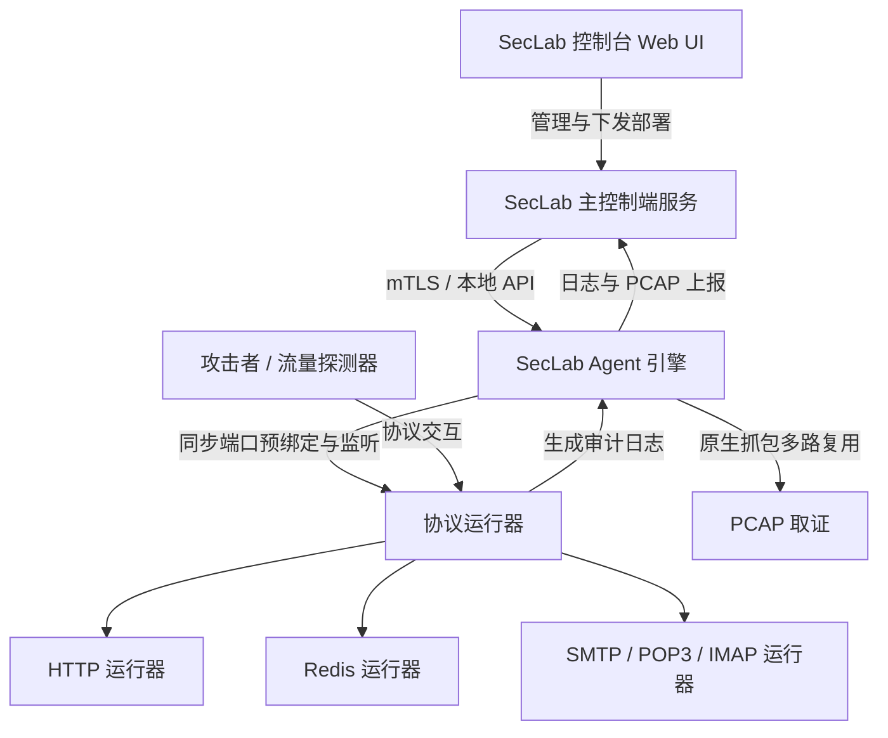
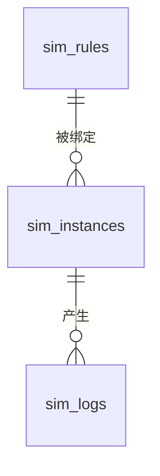

# SecLab 协议仿真模块设计规范

本文档定义 SecLab 分布式协议仿真模块（SecSim）的系统架构、数据模型、Agent 运行机制、协议扩展规范和通信接口。

---

## 1. 模块概述

### 1.1 设计目标

协议仿真（SecSim）在本地节点或远端节点上启动轻量级诱捕服务，模拟真实协议服务、应用指纹、漏洞响应和弱口令交互行为。系统记录攻击交互日志，并通过 Agent 原生 PCAP 取证能力保存网络报文证据。

### 1.2 核心业务边界与安全约束

- **协议能力**：当前内置 HTTP、Redis、SMTP、POP3 与 IMAP 运行器。协议能力由主控能力表声明，Agent 运行器按协议独立实现。
- **运行边界**：主控负责规则管理、实例编排、状态持久化和审计归档；Agent 负责端口监听、协议响应、交互日志上报和 PCAP 取证。
- **安全边界**：PCAP 下载端点必须限制文件名和读取目录。Agent 与主控之间的运行时通信遵循本地 Unix Socket 或 HTTPS/mTLS 通道约束。

---

## 2. 系统架构

SecSim 采用 **“控制台集中管控 + 边缘 Agent 独立监听”** 的分布式解耦架构。

- **管理与调度**：用户通过控制台 UI 创建和整编仿真规则（Rules），选择目标节点和端口一键部署（Deploy）。控制端通过 mTLS 或本地信道向节点 Agent 发送启动指令。
- **本地节点部署**：本地节点使用固定标识 `local`。主控将本地 Agent 纳入统一部署路径。
- **独立运行器**：Agent 进程通过异步协程在指定端口启动协议运行器。运行器独立于 Agent API 请求生命周期。
- **取证能力**：PCAP 由 Agent 原生抓包多路复用模块提供，按端口分发报文并在停止抓包后上报主控。

---

## 3. 数据表模型设计 (Schema)

所有仿真配置、运行实例以及审计日志统一持久化于 `seclab.db` SQLite 数据库中。

### 3.1 仿真配置规则表 (`sim_rules`)

存储内置或用户自定义的协议仿真规则配置。

- `id` (INTEGER, PK): 规则唯一 ID。
- `name` (TEXT): 规则中文名称。
- `name_en` (TEXT): 规则英文名称.
- `cve` (TEXT, Nullable): 关联的 CVE 编号。
- `category` (TEXT): 漏洞分类（`'vuln_sim'`, `'honeypot'`）。
- `description_zh` (TEXT): 中文描述信息。
- `description_en` (TEXT): 英文描述信息。
- `protocol` (TEXT): 仿真协议类型，例如 `http`、`redis`、`smtp`、`pop3`、`imap`。
- `default_port` (INTEGER, Nullable): 默认监听端口。
- `config_yaml` (TEXT): 协议运行器配置。不同协议使用独立 schema。

### 3.2 节点仿真运行实例表 (`sim_instances`)

记录被成功分发并在节点上监听的活跃仿真实例。

- `instance_id` (TEXT, PK): 实例唯一 ID（UUID v7）。
- `node_id` (TEXT): 部署的目标节点 ID（支持 `'local'` 及节点 UUID）。
- `rule_id` (INTEGER, FK): 关联的仿真规则 ID，支持级联删除 (`ON DELETE CASCADE`)。
- `listen_port` (INTEGER): 物理监听端口。
- `status` (TEXT): 运行状态（`'active'`, `'inactive'`, `'error'`）。
- `error_message` (TEXT, Nullable): 绑定失败等异常时的错误记录。

本地节点使用 `local` 标识。节点与仿真实例的拓扑关系由业务层维护。

### 3.3 协议仿真交互审计日志表 (`sim_logs`)

归档攻击者与诱捕服务交互产生的审计日志。

- `log_id` (INTEGER, PK AUTOINCREMENT): 自增日志 ID。
- `instance_id` (TEXT): 关联的实例 ID（若物理实例失效，则回填对应的规则 ID 字符串以增强容错性）。
- `node_id` (TEXT): 产生日志的节点 ID。
- `client_ip` (TEXT): 攻击者 IP 地址。
- `client_port` (INTEGER): 攻击者随机源端口。
- `event_type` (TEXT): 日志事件类型，例如 `connection`、`http_request`、`redis_command`、`smtp_command`、`pop3_command`、`imap_command`、`auth_attempt`、`exploit_attempt`。
- `detail_summary` (TEXT): 语义化的威胁审计总结。
- `payload_hex` (TEXT, Nullable): 攻击请求 Header/Body 的 16 进制原始包备份。
- `pcap_file_path` (TEXT, Nullable): 主控保存的 PCAP 文件相对路径。

控制端根据 Agent 上报的 `node_id`、`rule_id` 和监听端口回填实例关联信息。

---

## 4. 边缘 Agent 核心运行机制

### 4.1 同步端口预绑定校验

Agent 采用同步预绑定机制确认端口可用性：

- 收到控制端 `/start` 部署指令后，API 路由处理器首先在**同步阻塞阶段**尝试对目标地址和端口执行 `tokio::net::TcpListener::bind`：
  - **若端口被占用或权限不足**：在 API 阶段返回错误，控制端不写入运行实例。
  - **若成功绑定**：将 `TcpListener` 传递给后台运行协程，避免检测与实际监听之间的竞态。

### 4.2 Agent 模块结构

Agent 侧协议仿真运行器集中在 `crates/seclab-agent/src/services/simulation/`：

| 文件             | 职责                           |
| :--------------- | :----------------------------- |
| `mod.rs`         | 声明子模块并导出运行器 API。   |
| `common.rs`      | 审计日志上报和通用清理工具。   |
| `http.rs`        | HTTP 协议运行器。              |
| `redis.rs`       | Redis 协议运行器。             |
| `smtp.rs`        | SMTP 协议运行器。              |
| `pop3.rs`        | POP3 协议运行器。              |
| `imap.rs`        | IMAP 协议运行器。              |
| `mail_common.rs` | 邮件协议共享结构和行协议工具。 |
| `pcap.rs`        | PCAP 抓包多路复用与上传。      |

### 4.3 HTTP 协议运行器

在 Axum 的 `fallback` 路由处理器中部署通用拦截器 `simulation_handler`：

1. **静态 Banner 伪造**：重写 `Server` 标头（如 `Server: nginx/1.24.0 (Ubuntu)`），提供服务指纹响应。
2. **常规请求响应**：未命中漏洞路径时，返回规则定义的默认 HTML 页面。
3. **攻击路径匹配**：请求的 `path` 和 `method` 命中配置后，返回规则定义的 HTTP 状态码、响应体和响应头，并上报 `exploit_attempt` 日志。

### 4.4 Redis 协议运行器

Redis 运行器基于 TCP 监听处理 RESP 命令：

1. **连接审计**：客户端建立连接后上报 `connection` 日志。
2. **命令响应**：支持 `PING`、`AUTH`、`INFO`、`KEYS`、`GET`、`SET` 等基础命令响应。
3. **诱捕语义**：高风险命令或自定义命令命中后上报 `exploit_attempt` 或规则定义的事件类型。
4. **自定义响应**：规则可通过 `command_responses` 定义命令名、参数匹配、响应内容和事件类型。

### 4.5 邮件协议运行器

SMTP、POP3 与 IMAP 运行器基于明文 TCP 行协议实现：

1. **SMTP**：支持 `EHLO/HELO`、`AUTH PLAIN/LOGIN`、`MAIL FROM`、`RCPT TO`、`DATA`、`RSET`、`VRFY`、`EXPN`、`NOOP`、`QUIT`。
2. **POP3**：支持 `CAPA`、`USER`、`PASS`、`AUTH PLAIN`、`STAT`、`LIST`、`UIDL`、`RETR`、`TOP`、`DELE`、`RSET`、`NOOP`、`QUIT`。
3. **IMAP**：支持 tagged command 流程，包括 `CAPABILITY`、`LOGIN`、`AUTHENTICATE PLAIN`、`LIST`、`STATUS`、`SELECT`、`SEARCH`、`FETCH`、`UID FETCH`、`STORE`、`LOGOUT`。
4. **数据来源**：邮箱、邮件、能力声明、认证凭据和命令覆盖响应均来自规则 `config_yaml`。
5. **安全边界**：邮件协议第一版不提供 TLS、STARTTLS、SMTPS、POP3S 或 IMAPS。

### 4.6 PCAP 取证

PCAP 取证由 Agent 原生抓包模块提供：

1. 主控通过 Agent 仿真 API 启停指定端口的抓包槽。
2. Agent 使用全局 Raw Socket 监听网络报文。
3. 报文按 TCP 源端口或目的端口分发到对应抓包槽。
4. 抓包停止后，Agent 将 PCAP 文件通过 `multipart/form-data` 上报主控。
5. 临时 PCAP 文件由清理 Guard 自动删除。

详细设计见 [SecLab交互式PCAP流量取证设计规范.md](SecLab交互式PCAP流量取证设计规范.md)。

## 5. 协议扩展规范

新增协议时，应按以下顺序扩展：

1. **声明协议能力**

   在 `crates/seclab/src/services/simulation_protocols.rs` 增加协议定义，声明协议标识、展示名称、默认端口、是否支持部署、是否支持自定义规则和支持的规则类型。

2. **实现 Agent 运行器**

   在 `crates/seclab-agent/src/services/simulation/` 新增 `{protocol}.rs`，定义协议配置结构、监听逻辑、响应逻辑和审计日志上报逻辑。

3. **导出运行器**

   在 `crates/seclab-agent/src/services/simulation/mod.rs` 声明子模块，并导出启动函数和配置类型。

4. **接入启动分发**

   在 `crates/seclab-agent/src/api/simulation.rs` 将协议标识映射到对应运行器。配置解析应在启动前完成，解析失败直接返回错误。

5. **补充规则库 schema**

   在 `crates/seclab-sim-rules/src/lib.rs` 增加协议 schema 审计模型、目录校验和样例规则校验。

6. **补充规则内容**

   在 `crates/seclab-sim-rules/rules/` 下按协议和分类新增规则目录与 YAML 文件。

7. **更新前端配置入口**

   当新协议需要自定义规则表单、详情解析或专属字段展示时，更新 `frontend/src/apps/views/SimulationView.vue` 和相关本地化文案。

## 6. 通信接口与规范说明

控制端和 Agent 的通信接口使用统一的驼峰命名法（`camelCase`）进行序列化与反序列化。

### 6.1 规则 ID (Rule ID) 类型映射与系统边界契约

规则 ID 按系统分层使用不同物理类型：

控制端数据库使用 `i64`；网络交互、Agent 内存和上报载荷使用 `String`。

| 系统分层位置                   | 采用的物理数据类型                 | 设计契约与规范依据                                                                                            |
| :----------------------------- | :--------------------------------- | :------------------------------------------------------------------------------------------------------------ |
| **控制端本地数据库物理列**     | **`i64` (INTEGER)**                | `sim_rules.id` 与 `sim_instances.rule_id` 以数字形式存储，享受主键及外键级联加速。                            |
| **前端 Web & TypeScript 模型** | **`number`**                       | `SimRule.id` 与 `DeploySimReq.ruleId` 保持与控制端核心 API 的强类型匹配。                                     |
| **API 部署分发载荷**           | **`i64` -> `String` 转换**         | 控制端向 Agent 发送部署指令时，动态调用 `rule_id.to_string()` 将数字转为字符串形式下发。                      |
| **边缘 Agent 内存与端口映射**  | **`String`**                       | `rule_id` 在内存常驻句柄及 API 中均以 `String` 承接，支持未来非纯数字字符串 ID 临时规则。                     |
| **威胁日志及 PCAP 上报载荷**   | **`String` (camelCase: `ruleId`)** | Agent 异步向主控 `POST /api/v1/simulation-public/log` 汇报审计及 Multipart 抓包文件时，统一以字符串形式传输。 |
| **主控日志接收处理器**         | **`String`**                       | 控制端 `ReportSimLogRequest` 接口处使用 `String` 桥接，并在 `sim_logs.instance_id`（TEXT）字段落库。          |

---

### 6.2 主要控制端 API 路由

| 路由类型   | API 端点路径                                  | 说明                                                           |
| :--------- | :-------------------------------------------- | :------------------------------------------------------------- |
| **GET**    | `/api/v1/simulation/rules`                    | 列出所有内置及自定义的仿真诱捕规则。                           |
| **POST**   | `/api/v1/simulation/rule`                     | 创建新的协议仿真自定义规则。                                   |
| **DELETE** | `/api/v1/simulation/rule/{id}`                | 删除指定的仿真规则。                                           |
| **POST**   | `/api/v1/simulation/deploy`                   | 向特定节点/本地节点部署并动态开启特定规则和端口的监听。        |
| **POST**   | `/api/v1/simulation/undeploy`                 | 注销目标端口上的协议仿真服务。                                 |
| **GET**    | `/api/v1/simulation/node/{node_id}/instances` | 获取特定节点上当前正在运行的所有活跃仿真实例列表。             |
| **GET**    | `/api/v1/simulation/node/{node_id}/logs`      | 获取特定节点下当前最新的 100 条协议仿真威胁审计日志。          |
| **GET**    | `/api/v1/simulation/pcap/download/{filename}` | 安全地下载关联攻击交互的 PCAP 数据包，支持物理路径防穿透校验。 |

### 6.3 Agent 数据上报端点

控制端提供 Agent 审计上报端点，用于接收仿真交互日志和 PCAP 文件。

- **端点路由**：`POST /api/v1/simulation-public/log`，接收 `ReportSimLogRequest` 格式的日志载荷。
- **端点路由**：`POST /api/v1/simulation-public/pcap`，以 `multipart/form-data` 格式接收 PCAP 文件。
